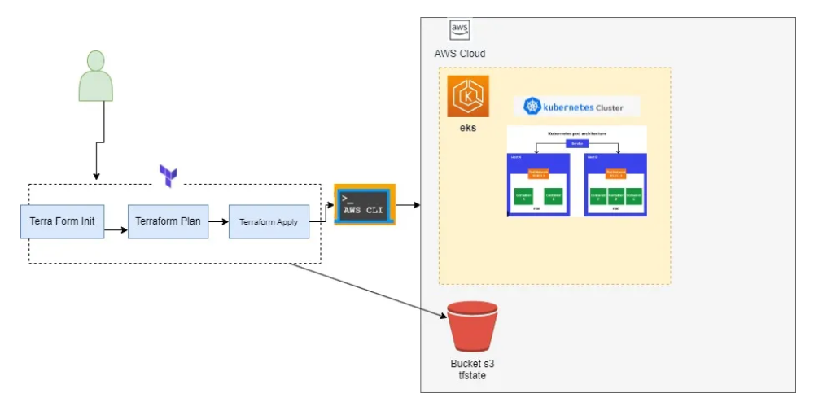

# cluster-kubernetes-terraform-aws
Cluter kuberneter  with terraform and aws

<!---Esses são exemplos. Veja https://shields.io para outras pessoas ou para personalizar este conjunto de escudos. Você pode querer incluir dependências, status do projeto e informações de licença aqui--->




>Provisionando um Cluster Kubernetes utilizando o Terraform e AWS.

### Ajustes e melhorias

O projeto ainda está em desenvolvimento e as próximas atualizações serão voltadas nas seguintes tarefas:

- [x] Instalando o Terraform 
- [x] Configurando o Terraform 
- [x] instalado e configurando o AWS CLI


## 💻 Pré-requisitos

Antes de começar, verifique se você atendeu aos seguintes requisitos:
<!---Estes são apenas requisitos de exemplo. Adicionar, duplicar ou remover conforme necessário--->
* Você possui uma conta  `AWS`
* Você instalou e configurou o AWS CLI 
* Você instalou e configurou o Terraform em seu PC `<linguagem / dependência / requeridos>`
* leia o artigo  `#`.

## 🚀 Instalando <nome_do_projeto>

Para instalar o <cluster-kubernetes-terraform-aws>, siga estas etapas:


Windows:
```
<comando_de_instalação>
```

## ☕ Usando <nome_do_projeto>

Para usar <cluster-kubernetes-terraform-aws>, siga estas etapas:

```
<exemplo_de_uso>
```

Adicione comandos de execução e exemplos que você acha que os usuários acharão úteis. Fornece uma referência de opções para pontos de bônus!

## 📫 Contribuindo para <nome_do_projeto>

Para contribuir com <cluster-kubernetes-terraform-aws>, siga estas etapas:

1. Bifurque este repositório.
2. Crie um branch: `git checkout -b <nome_branch>`.
3. Faça suas alterações e confirme-as: `git commit -m '<mensagem_commit>'`
4. Envie para o branch original: `git push origin <nome_do_projeto> / <local>`
5. Crie a solicitação de pull.

Como alternativa, consulte a documentação do GitHub em [como criar uma solicitação pull](https://help.github.com/en/github/collaborating-with-issues-and-pull-requests/creating-a-pull-request).

## 🤝 Colaboradores

Agradecemos às seguintes pessoas que contribuíram para este projeto:


## 😄 Seja um dos contribuidores<br>

Quer fazer parte desse projeto? Clique [AQUI](CONTRIBUTING.md) e leia como contribuir.

## 📝 Licença

Esse projeto está sob licença. Veja o arquivo [LICENÇA](LICENSE.md) para mais detalhes.

[⬆ Voltar ao topo](#cluster-kubernetes-terraform-aws)<br>
